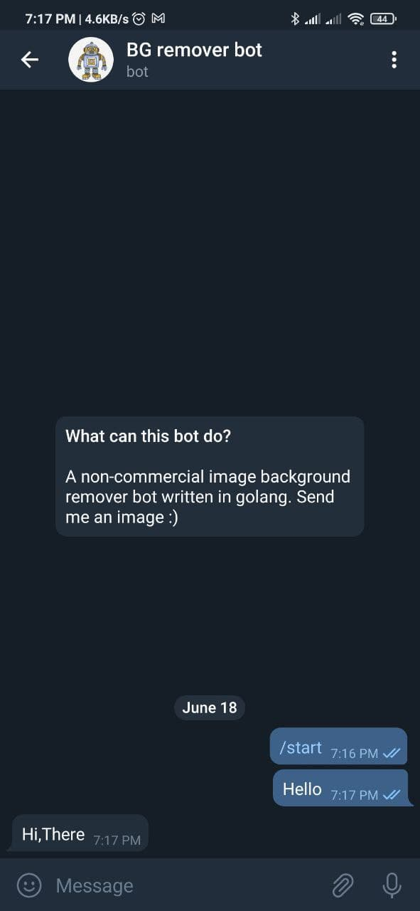
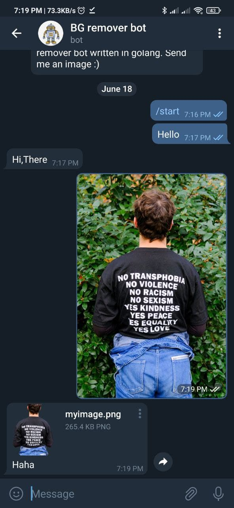
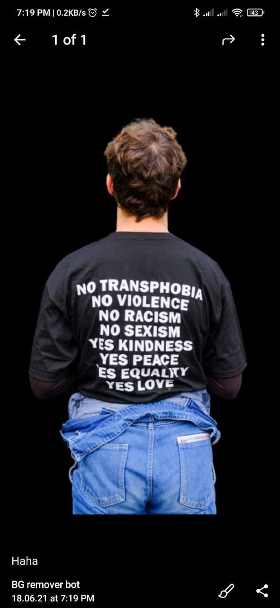

# BG Remover BOT

BgRemoverBot is a image background remover bot written in pure golang.It uses the  api.
This is a non-commercial hobby project writter in golang.

Here are a few screenshots

|  |  |  | 
|--|--|--|
